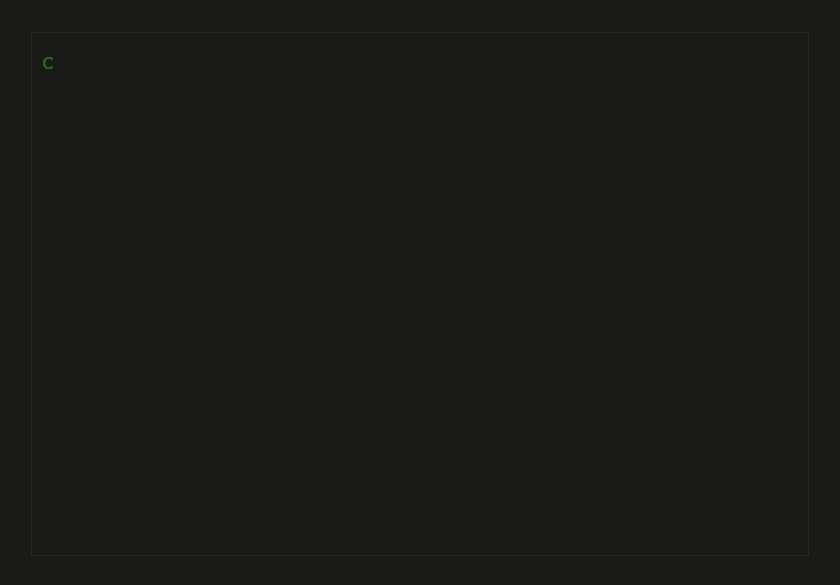
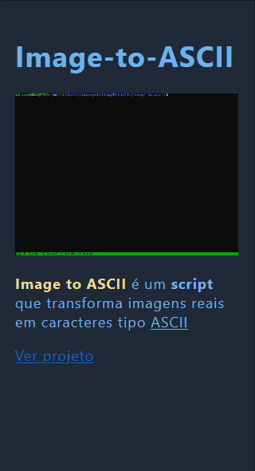

<h1> Olá !   Me chamo Adriano 
</h1>

<small><b>Full-stack dev</b></small>
   

<!-- Terminal .gif -->

    

   

## Habilidades :

<!-- I'm using shields.io badges for now -->

- **Frontend:**   
    &emsp;&emsp;&emsp;&emsp;&emsp;

- **Backend:**  
    &emsp;

- **Banco de dados:**   
    &emsp;&emsp;&emsp;

- **Deploy:**  
    &emsp;&emsp;

- **Outras:**  
    &emsp;&emsp;&emsp;

- **Ide's:**  
    &emsp;

- **OS:**  
    &emsp;&emsp;

 

## Projetos
  

<!-- Placeholders ... -->

      <a href='https://github.com/AdrianoLMRS/Pousada-TAO?tab=readme-ov-file#readme'>
         <!-- Pousada TAO -->
      </a>&emsp;&emsp;
      <a href='https://github.com/AdrianoLMRS/Image-to-ASCII'>
         <!-- Image-to-ASCII -->
      </a>&emsp;&emsp;

  

### 

Pousada TAO

> Clique [aqui](https://github.com/AdrianoLMRS/Pousada-TAO?tab=readme-ov-file#readme) para ver o repositório
>> <table width="100%">
  <thead>
    <tr>
      <th align="left" colspan="2"><strong>Detalhes do Projeto</strong></th>
    </tr>
  </thead>
  <tbody>
    <tr>
      <td width="20%"><strong>Frontend</strong></td>
      <td>HTML, CSS, JavaScript (puro)</td>
    </tr>
    <tr>
      <td><strong>Backend</strong></td>
      <td>Node.js, Express.js</td>
    </tr>
    <tr>
      <td><strong>Banco de Dados</strong></td>
      <td>
        MongoDB com Mongoose  
        (<a href="https://www.mongodb.com/resources/products/platform/mongodb-atlas-tutorial">MongoDB Atlas</a>)
      </td>
    </tr>
    <tr>
      <td><strong>Deploy</strong></td>
      <td>Docker hospedado no <a href="https://render.com/about">Render</a></td>
    </tr>
    <tr>
      <td><strong>Pagamentos</strong></td>
      <td><a href="https://www.nerdwallet.com/article/small-business/what-is-stripe">Stripe</a></td>
    </tr>
    <tr>
      <td><strong>Mensagens</strong></td>
      <td>Email com Nodemailer&emsp;&emsp;||&emsp;&emsp;SMS com Twilio</td>
    </tr>
    <tr>
      <td><strong>API's</strong></td>
      <td>
        Stripe&emsp;&emsp;||&emsp;&emsp;Auth0 com MongoDB
      </td>
    </tr>
  </tbody>
</table> 

<!--  -->
<!--
**AdrianoLMRS/AdrianoLMRS** is a ✨ _special_ ✨ repository because its `README.md` (this file) appears on your GitHub profile.

Here are some ideas to get you started:

- 🔭 I’m currently working on ...
- 🌱 I’m currently learning ...
- 👯 I’m looking to collaborate on ...
- 🤔 I’m looking for help with ...
- 💬 Ask me about ...
- 📫 How to reach me: ...
- 😄 Pronouns: ...
- ⚡ Fun fact: ...
-->
