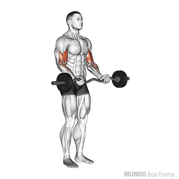
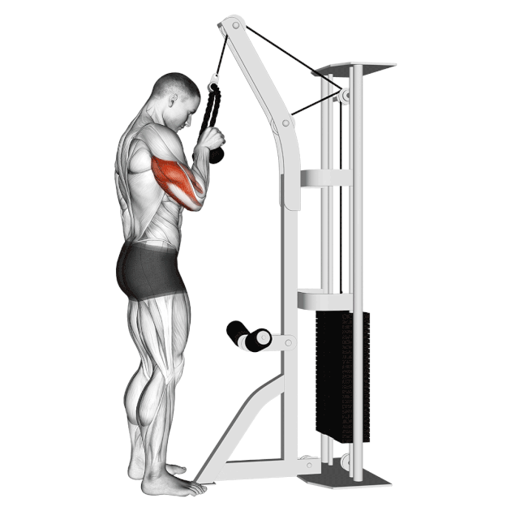

# Academia

Treinos & exercícios + execução deles

---

## Full Body

1. 

<b>Pulley Frente</b>

   
<a href="https://www.youtube.com/watch?v=Hu3TbPgEGDo" target="_blank">Vídeo do Laércio</a>

     
   

2. 

<b>Crucifixo Máquina / Supino Máquina</b>

   <header><strong>Crucifixo Máquina</strong></header>
   

    <a href="https://www.youtube.com/watch?v=J1YnmuweOkM" target="_blank">Vídeo do Laércio (Crucifixo Máquina)</a> 
    <ol type="1" >
      <li>Regular o Banco - Braços da mesma altura do aparelho.</li>
      <li>Regular o braço da máquina - Sentir musculatura alongando (mas sem machucar o ombro).</li>
      <li>Postura - Peito pra fora, escápula fechada e ombro baixo.</li>
      <li>Execução - Alonga o máximo mas sem encostar (volta), fechou; encostou; aperta e empurra (ida).</li>
    </ol>
   

     
   

3. 

<b>Elevação Lateral</b>

   

    <a href="https://www.youtube.com/watch?v=c7zMmbWkUPw&t=25s" target="_blank">Vídeo do Laércio</a> 
    <ol type="1" >
      <li>Subir somente até a altura do ombro.</li>
      <li>Parar o peso antes de alinhar pra manter tensão na musculatura.</li>
      <li>Flexionar um pouco o cutuvelo.</li>
      <li>Ombro; cutuvelo e punho na mesma reta/linha.</li>
    </ol>
   

     
   

4. 

<b>Agachamento / Leg Press</b>

   <header><strong>Leg Press 45°</strong></header>
   

    <a href="https://www.youtube.com/watch?v=adPY6cd4h58&t=16s" target="_blank">Vídeo do Laércio (Leg Press)</a> 
    <ol type="1" >
      <li>Regular Máquina - plataforma baixa; ajustar banco; ver trava de segurança.</li>
      <li>Posição dos pés - Iguais, com mesmo afastamento e direção (ponta um pouco + afastada).</li>
      <li><b>NÃO FORÇAR LOMBAR</b> - descer o máximo até o quadril permanecer apoiado.</li>
      <li>Não estender completamente joelho na subida (para manter tensão).</li>
      <li>Manter pressão no calcanhar, não soltar da plataforma (dica: sentir peso no pé inteiro).</li>
      <li>Não trazer o joelho para dentro na subida.</li>
    </ol>
   

     
   

5. 

<b>Cadeira Flexora</b>

   

    <a href="https://www.youtube.com/watch?v=c7zMmbWkUPw&t=25s" target="_blank">Vídeo do Laércio</a>  
    <b>Ajuste de Máquina</b>
    <ol type="1" >
      <li>Eixo da máquina coincidir com o eixo da perna (joelho).</li>
      <li>Rolete da máquina no tendão de aquiles do pé.</li>
      <li>Baixar parte de cima o máximo possível desde que fique confortável.</li>
    </ol>
    <b>Execução do exercício</b>
    <ol type="1" >
      <li>Boa postura geral na máquina.</li>
      <li>Não empurrar o quadril para frente ou arquear a lombar (ambos apoiados).</li>
      <li>Puxar e voltar o máximo que puder.</li>
      <li>Pe de "bailarina" e depois pé de "voadora"</li>
    </ol>
   

     
   

### Exercícios Opcionais

6. 

<b>Rosca Direta</b>

   

    <a href="https://www.youtube.com/watch?v=FHyZEuRpSg4" target="_blank">Vídeo do Laércio</a> 
    <ol type="1" >
      <li>Escolher barra da sua preferência.</li>
      <li>Não afastar o cutuvelo (deixar encostado).</li>
      <li>Não subir o ombro (acaba forçando o trapézio) - <b>ombro baixo</b>.</li>
      <li>Estender braço até o final sem perder tensão.</li>
      <li>Não balançar o corpo.</li>
    </ol>
   

     
   

7. 

<b>Tríceps Pulley</b>

   

    <a href="https://www.youtube.com/watch?v=cQ5ae1dHTAQ&t=10s" target="_blank">Vídeo do Laércio</a> 
    <ol type="1" >
      <li>Pés paralelos OU antero posterior.</li>
      <li>Cutuvelo cola no corpo e postura encaixada.</li>
      <li>Boa postura - peito estufado, pés separados, ombros para trás, cutuvelo fechado etc.</li>
      <li>Amplitude - descer tudo (cutuvelo ficar reto) e subir inteiro sem relaxar o músculo.</li>
      <li>Não compensar no lado fraco (causa assimetria).</li>
    </ol>
   

     
   

8. 

<b>Panturrilha em Pé</b>

   
Panturrilha né...

     
   

### Full Body 2 (30 minutos)

1. **Agachamento Livre**  
2. **Cadeira Flexora**  
3. **Pulley Frente**  
4. **Dumbbell Press**  
5. **Elevação Lateral**  
